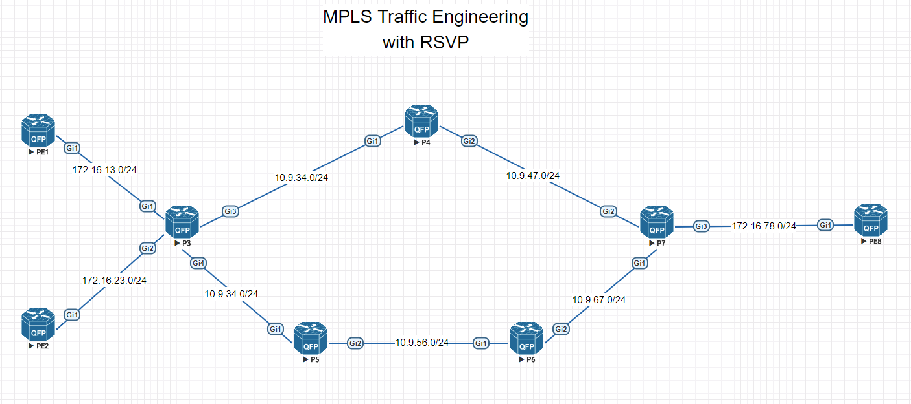
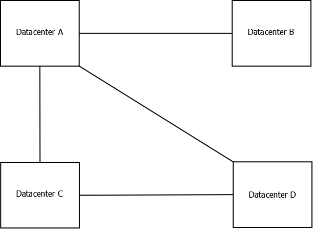
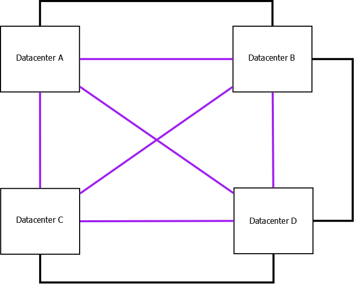

## 1. The Problem
  * Link State IGP's use SPF
    * path selection is based on cost
    * when is cost not sufficient?

## 2. Principles of Traffic Engineering
  * CSPF
  * RSVP
    * roots in QoS
      * resource conflict arbitration vs. conflict avoidance
      * hop-by-hop reservation system
    * with TE, hosts do not participate in RSVP, only routers
  * Where is the state located?
    * Hard state refresh vs. Soft state refresh
  * IGP modifications
    * TE database
  * What is a TE Tunnel?
    * representation of an LSP
      * unidirectional
      * signalled from the headend

## 3. High-level TE Design Concepts

  * strategic
  * tactical
  * fast convergence

## 4. Implementation Example



  * base configuration requirements
    * enabled globally
    * enabled in the IGP
    * for ISIS: metric-style wide
    * TE router-id configured in the IGP
    * TE enabled on appropriate interfaces
    * RSVP enabled on appropriate interfaces

  * IOS-XE configuration example:
```
mpls traffic-eng tunnels
!
router isis lab
 metric-style wide    !! required to enable IS-IS to carry the TE database
 mpls traffic-eng router-id Loopback0     !! which IP interface will be the source for RSVP PATH and RESV messages
 mpls traffic-eng level-2
!
interface GigabitEthernet1
 mpls traffic-eng tunnels
 ip rsvp bandwidth       !! tell RSVP to reserve some of this interface's bandwidth for TE tunnels. default is 75%.
```

  * tunnel requirements
    * tunnel type
    * method for making tail-end routes available via the tunnel
      * you don't run an IGP over the tunnel
    * path option
      * explict path
        * next hop
        * exclude

  * IOS-XE configuration example:
```
interface Tunnel18
 ip unnumbered Loopback0
 tunnel mode mpls traffic-eng
 tunnel destination 8.8.8.8
 tunnel mpls traffic-eng autoroute announce   !! pull the routes on the tailend back through the tunnel
 tunnel mpls traffic-eng path-option 10 explicit name PE1-to-PE8  !! tell the tunnel which path to take, hop by hop
!
ip explicit-path name PE1-to-PE8 enable
 next-address 172.16.13.3
 next-address 10.9.35.5
 next-address 10.9.56.6
 next-address 10.9.67.7
 next-address 172.16.78.8
```

## 5. Use Cases
  * Most use cases will involve using a private backbone of some sort
  * Case 1: 1 odd duck link (strategic)



  * Case 2: New nontransit datacenter (strategic)

  * Case 3: Transition from IPSec VPN over Internet to private backbone (tactical or strategic)



## 6. Further Reading
  * Books
    * Traffic Engineering with MPLS (Osborne and Simha, Cisco Press)
      * https://www.safaribooksonline.com/library/view/traffic-engineering-with/1587050315/
    * MPLS-Enabled Applications (Minei and Lucek, Wiley)
      * https://www.safaribooksonline.com/library/view/mpls-enabled-applications-emerging/9780470976135/
  * Docs and Blogs
    * https://www.cisco.com/c/dam/en/us/products/collateral/ios-nx-os-software/multiprotocol-label-switching-archive/prod_white_paper0900aecd803128b9.pdf
    * https://www.youtube.com/watch?v=1cD8w4H-eKE
    * http://blog.ipspace.net/2008/09/do-you-need-ldp-with-mpls-te.html
    * https://www.cisco.com/c/en/us/support/docs/multiprotocol-label-switching-mpls/mpls/29828-mplsvpnte.html
    * https://learningnetwork.cisco.com/thread/117654
    * http://lostintransit.se/2014/08/24/a-quick-look-at-mpls-te/
